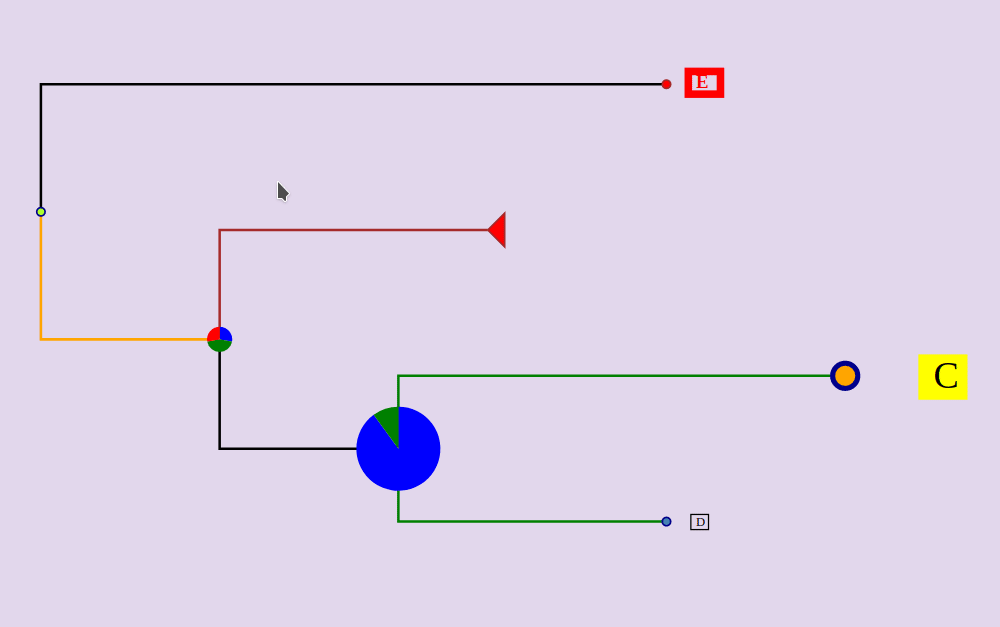
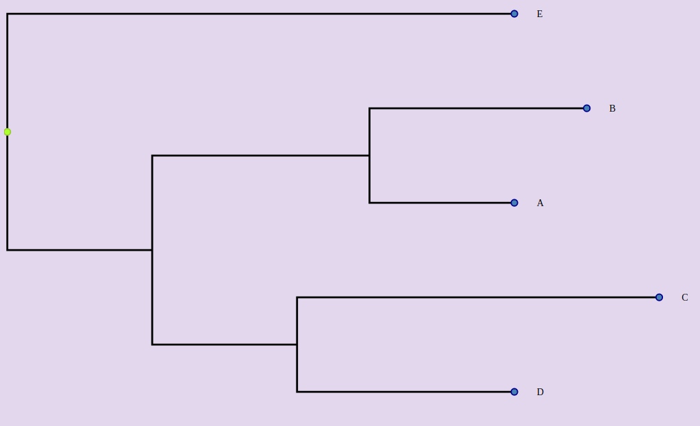
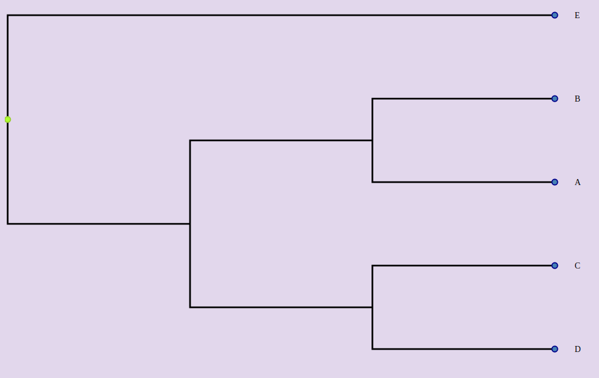
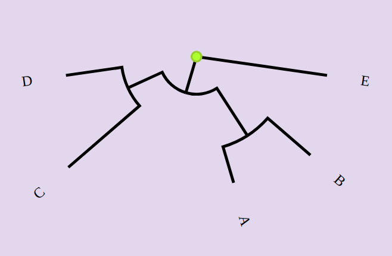
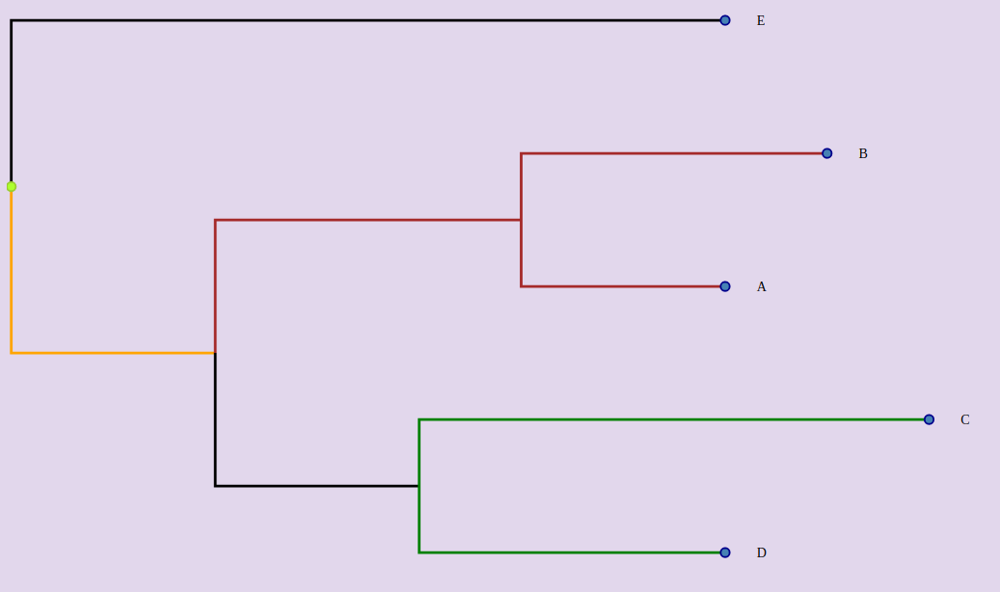
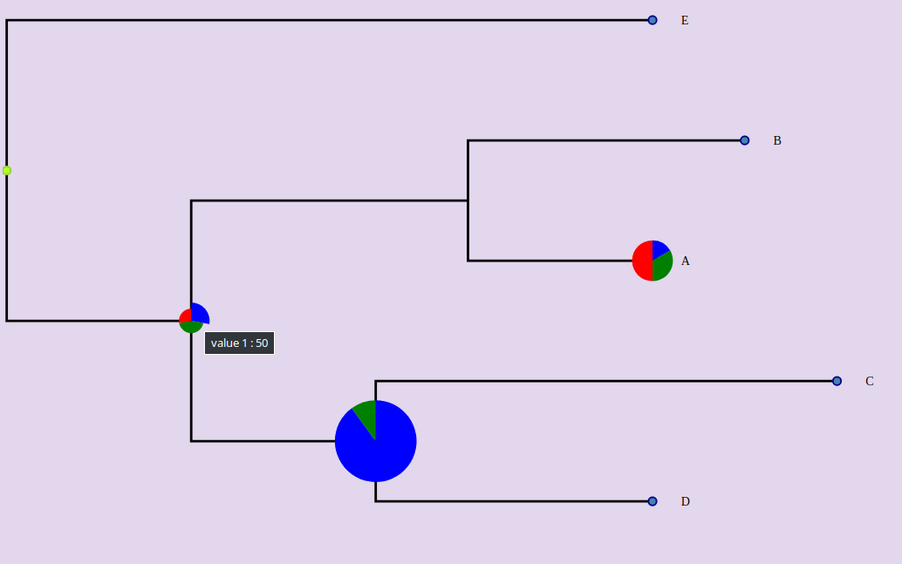

# vue-phylogram


## Synopsis

Vue component for displaying phylogenetic trees




## Installation

npm install --save vue-phylogram

## Features

 * Sources: json or newick
 * Zoom & Pan
 * Display branch lengths or not
 * Circular or linear layout
 * Metadata on nodes, branches and labels (size, color)
 * Display pies on nodes
 * Collapse nodes

## Browse the tree

 * Zoom with the mouse wheel
 * Drag & drop to move into the tree
 * Hover a node or a label to increase its size
 * Select/Deselect a node by clicking on it and by choosing "Select/Deselect" in the menu
 * Collapse/Expand a node by clicking on it  and by choosing "Collapse/Expand" in the menu

## Import in a .vue file

~~~~
import { Phylogram} from 'vue-phylogram';
~~~~

## Data Sources

The following tree can be represented by two formats : newick or json object.


### From newick

~~~~
<Phylogram :newick="newick"></Phylogram>
~~~~

~~~~
 data () {
    return {
		newick : "(((A:0.2, B:0.3):0.3,(C:0.5, D:0.3):0.2):0.3, E:0.7):1.0"
		....
~~~~

### From Json object

~~~~
<Phylogram :inputTree="tree"></Phylogram>
~~~~

Each node can have these attributes :
 * id : if not, will be computed. Be careful, to map metadata on nodes, they must have an id.
 * name : if not, the node label won't be displayed.
 * length : the length of the branch before the node. If not, the length will be 0.
 * branchset : the list of the nodes starting from this node. If absent, the node will be a leaf of the tree.


~~~~
 data () {
    return {
		tree: {
        id: 'ABCDE',
        branchset: [
          {
            id: 'ABCD',
            length: 0.2,
            branchset: [
              {
                length: 0.3,
                id: 'AB',
                branchset: [
                  {
                    name: 'A',
                    id: 'A',
                    length: 0.2
                  },
                  {
                    id: 'B',
                    name: 'B',
                    length: 0.3
                  }
                ]
              },
              {
                length: 0.2,
                id: 'CD',
                branchset: [
                  {
                    id: 'C',
                    name: 'C',
                    length: 0.5
                  },
                  {
                    id: 'D',
                    name: 'D',
                    length: 0.3
                  }
                ]
              }
            ]
          },
          {
            name: 'E',
            length: 0.7
          }
        ]
      }
		....
~~~~

## Generic layout

These props set up the generic layout :

 * width (default : 600)
 * height (default : 400)
 * margin (default : {top:10, right;10, bottom:10, left:10})
 * labelWidth : space allowed to display the labels (default : 200)

## Display a cladogram or a phylogram

A cladogram does not represent the branch lengths instead of the phylogram.

### Display a phylogram (default)



~~~~
<Phylogram :newick="newick"></Phylogram>
~~~~

or

~~~~
<Phylogram :newick="newick" :branch-lengths="true" ></Phylogram>
~~~~

or

~~~~
<Phylogram :newick="newick" branch-lengths ></Phylogram>
~~~~

### Display a cladogram



~~~~
<Phylogram :newick="newick" :branch-lengths="false" ></Phylogram>
~~~~


## Display tree with right or smooth angles

### Display tree with right angles (default)


~~~~
<Phylogram :newick="newick" right-angle></Phylogram>
~~~~

~~~~
<Phylogram :newick="newick" :right-angle="true" ></Phylogram>
~~~~


### Display tree with smooth angles 


~~~~
<Phylogram :newick="newick" :right-angle="false" ></Phylogram>
~~~~

## Circular layout




By default, the tree is displayed in a linear way. If you want to display the tree as a circle:

~~~~
<Phylogram :newick="newick" circular ></Phylogram>
~~~~

## Display labels

The labels are displayed by default. To hide them:
~~~~
<Phylogram :newick="newick" :display-labels="false" ></Phylogram>
~~~~

## Display leaves

Leaves are displayed by default. To hide them:

~~~~
<Phylogram :newick="newick" :display-leaves="false" ></Phylogram>
~~~~

## Display inner nodes

Inner nodes are hiddent by default. To show them:

~~~~
<Phylogram :newick="newick" :display-inner-nodes="true" ></Phylogram>
~~~~

## Align labels

By default, labels are displayed close to the nodes. If you want to right align them :

~~~~
<Phylogram :newick="newick" align-labels ></Phylogram>
~~~~

## Space for labels

If you want to increase or reduce the width of the space assigned to the labels, use the label-width prop:

~~~~
<Phylogram :newick="newick" :label-width=400 ></Phylogram>
~~~~

## Metadata

### Branch colors




~~~
<Phylogram :inputTree="tree" :branch-styles="branchStyles">
~~~

The branches are identified by the node that they reach (type:'to') or that they start from (type:'from') or both (type:'both') (default)

~~~
branchStyles: {
            CD: {
              color: 'green',
              type: 'from'
            },
            ABCD: {
              color: 'orange',
              type: 'to'
            },
            AB: {
              color: 'brown',
              type: 'both'
            }
          }
~~~

### Node styles


Size and color can be set for each leaf node

~~~
<Phylogram :inputTree="tree" :node-styles="nodeStyles">
~~~

~~~
nodeStyles: {
            C: {
              size: 3,
              color: 'orange'
            },
            B: {
              size: 0.5
            }
          }
        },
~~~

### Label styles 

~~~
<Phylogram :inputTree="tree" :label-styles="labelStyles">
~~~


Background, border and stroke colors can set for each label.

~~~
<Phylogram :inputTree="tree" :label-styles="labelStyles">
~~~

~~~
  labelStyles: {
            A: {
              color: 'orange',
              background: 'darkgreen',
              borderWidth: 2
            },
            C: {
              background: 'yellow'
            },
            D: {
              borderWidth: 1
            },
            E: {
              borderWidth: 4,
              borderColor: 'red'
            }
          },
~~~


### Display pies on nodes



Hover a part of the pie to display the corresponding values.

~~~
<Phylogram :inputTree="tree" :pies="pies">
~~~

Be careful, the ids of the nodes must be well specified. 

~~~
pies: {
            A: {
              data: [
                { label: 'value 1', value: 10, color: 'blue' },
                { label: 'value 2', value: 20, color: 'green' },
                { label: 'value 3', value: 30, color: 'red' }
              ],
              size: 5
            },
            ABCD: {
              data: [
                { label: 'value 1', value: 50, color: 'blue' },
                { label: 'value 2', value: 80, color: 'green' },
                { label: 'value 3', value: 50, color: 'red' }
              ],
              size: 3
            },
            CD: {
              data: [
                { label: 'value 1', value: 90, color: 'blue' },
                { label: 'value 2', value: 10, color: 'green' }
              ],
              size: 10
            }
          }
~~~

If you want to hide pies : 

~~~
<Phylogram :inputTree="tree" :pies="pies" :show-pies="false">
~~~

## Select nodes from props

Use the "selected" props and put the node ids separateb by commas.

~~~
<Phylogram :inputTree="tree" :selected="AB,E">
~~~

## Collapse nodes from props

Use the "selected" props and put the node ids separateb by commas.

~~~
<Phylogram :inputTree="tree" :collapsed="AB,CD">
~~~

## Use a function when a node is clicked

By default, a small menu that enables to select or to collapse the node is displayed when a node is clicked. But you can specify instead a function to launch when a node is clicked

~~~
<Phylogram :inputTree="tree" :clickNodeFn="customFunction">
~~~


~~~
customFunction : (node, event) => {console.log("click"s)}
~~~

## Events

 * select-nodes: when the user selects or deselect one node, returns the array of the selected node ids.

 * collapse-nodes: when the user collapses a node or uncollapse a node, returns the array of the collapsed node ids.


## Project setup
```
npm install
```

### Compiles and hot-reloads for development
```
npm run serve
```

### Compiles and minifies for production
```
npm run build
```

### Run your unit tests
```
npm run test:unit
```

### Lints and fixes files
```
npm run lint
```

### Customize configuration
See [Configuration Reference](https://cli.vuejs.org/config/).
